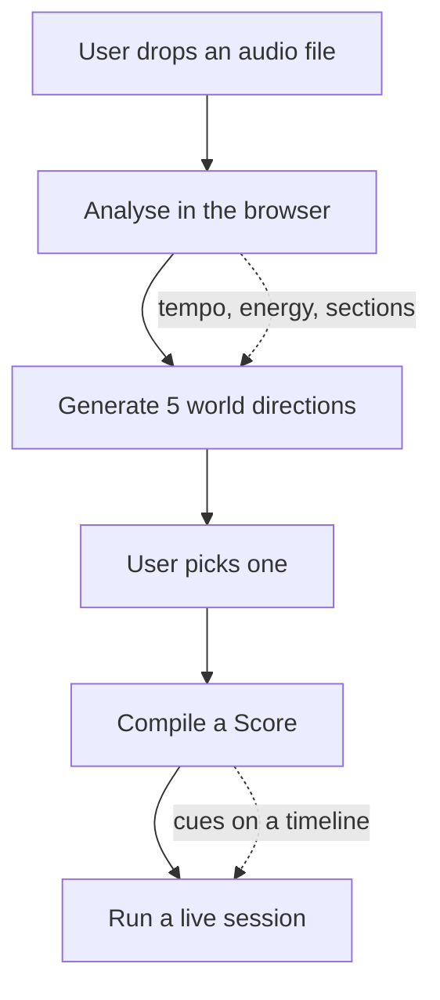
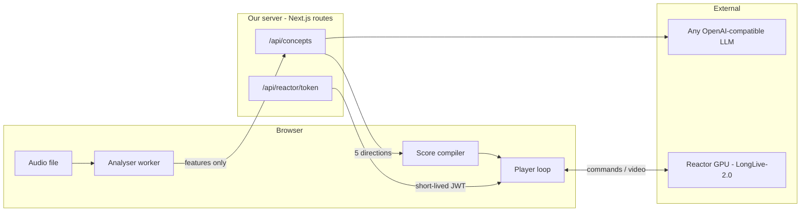
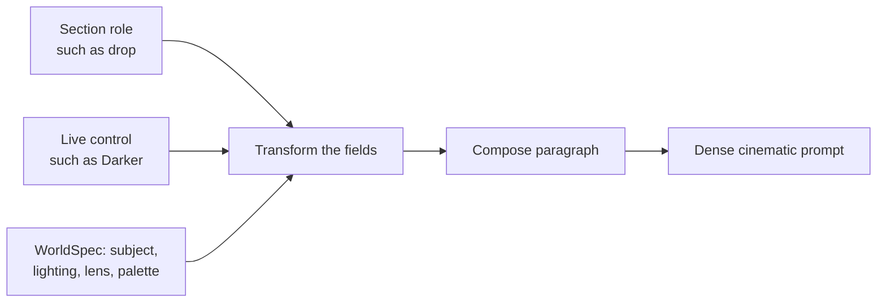

# How Worldscore works

Four screens, one idea: **a song is a control signal for a live world model.**

---

## 1. The whole thing, end to end



Each step in one line:

| Step | What happens | Where |
| --- | --- | --- |
| **Analyse** | Find tempo, beat grid, energy curve, section boundaries | Browser |
| **Generate** | Turn those features into 5 cinematic worlds | Server → LLM |
| **Compile** | Turn sections into a list of timed cuts and shots | Browser |
| **Run** | Fire those cues at the model while the song plays | Browser → Reactor GPU |

---

## 2. What runs where

This matters for privacy and cost.



Three things to notice:

- **The audio file never leaves the browser.** Only the derived numbers do. An
  unreleased mix stays on the musician's machine.
- **The API key never leaves the server.** The browser only ever gets a
  short-lived token scoped to one model.
- **Video comes straight from the GPU to the browser** over WebRTC. Our server
  isn't in the video path at all.

---

## 3. The clever bit: the steering loop

This is the part that makes it feel musical instead of random.

```mermaid
sequenceDiagram
    participant Song as Audio element
    participant Loop as Steering loop
    participant Model as LongLive-2.0

    Loop->>Model: set_shot "opening scene"
    Loop->>Model: start
    Model-->>Loop: generating
    Loop->>Song: play

    loop every animation frame
        Loop->>Song: what time is it?
        Song-->>Loop: 56.0s
        Note over Loop: a cut is due at 56.0s
        Loop->>Model: scene_cut "the drop scene"
    end

    Model-->>Loop: chunk_complete, scene chunk 41 of 48
    Note over Loop: near the scene limit
    Loop->>Model: scene_cut to stay alive
```

**The song is the master clock.** The model is not guaranteed to generate at
real time, so we never use its chunk counter for timing — we read
`audio.currentTime` and fire from that. Cues go out one chunk (~1.2s) early so
the change lands on the beat we aimed at.

The model's chunk counter is used for exactly one thing: a scene stops
generating at 48 chunks, so if we're close to that with nothing due, we cut
anyway.

---

## 4. From a section to a prompt

The model never receives "make it darker". It receives a full paragraph, rebuilt
every time.



A `WorldSpec` is a scene split into fields — subject, action, setting, time of
day, lighting, lens, camera move, palette, texture, render cue.

- A **section role** changes the camera and palette fields. A `drop` gets a
  violent crane move and maximum saturation; a `breakdown` gets a near-static
  hold and desaturation.
- A **live control** changes fields too. "Darker" rewrites lighting, palette and
  time of day.
- Then the composer renders **all** the fields into one paragraph.

Why rebuild the whole thing every time? Because a soft shot has to re-establish
the subject and setting or the model loses continuity. And because a field
transform is instant, while asking an LLM to rewrite the prompt would add
seconds to a live control.

---

## 5. Shots vs cuts

The one rule that drives the whole score:

| | Soft shot | Hard cut |
| --- | --- | --- |
| Feels like | same world, new beat | a new place |
| Scene memory | kept | wiped |
| Used for | verse, build, outro | drop, chorus, breakdown, bridge |
| Scene budget | spends it | **resets it** |

A scene dies at 48 chunks (~58 seconds). Only a cut resets that budget, so cuts
are also how a session runs longer than a minute. The compiler enforces this,
and the player double-checks it live.

---

## 6. Where the code lives

```
app/
  lib/audio/       decode -> STFT -> tempo, energy, sections
  lib/world/       WorldSpec, prompt composer, score compiler
  lib/concepts/    LLM generation + offline fallback library
  lib/store.ts     which screen we're on, what's fired

  components/      Upload -> Analyzing -> ConceptBoard -> Player
  api/             token minting, concept generation

  studio/page.tsx  the product
  landing/         the marketing page

scripts/           run the analyser without a browser
```

---

## 7. Why it's built to swap models

Everything above the last step is model-agnostic. The score is just a list of
timed cues; only the final hop translates a cue into `set_shot` / `scene_cut`.

Swap that one layer and the same engine drives a different model — Helios for
tracks that should morph rather than cut, LingBot for a navigable dream mode.
Same for the input side: audio is one signal source, and webcam affect or a
dream description would produce cues the exact same way.
