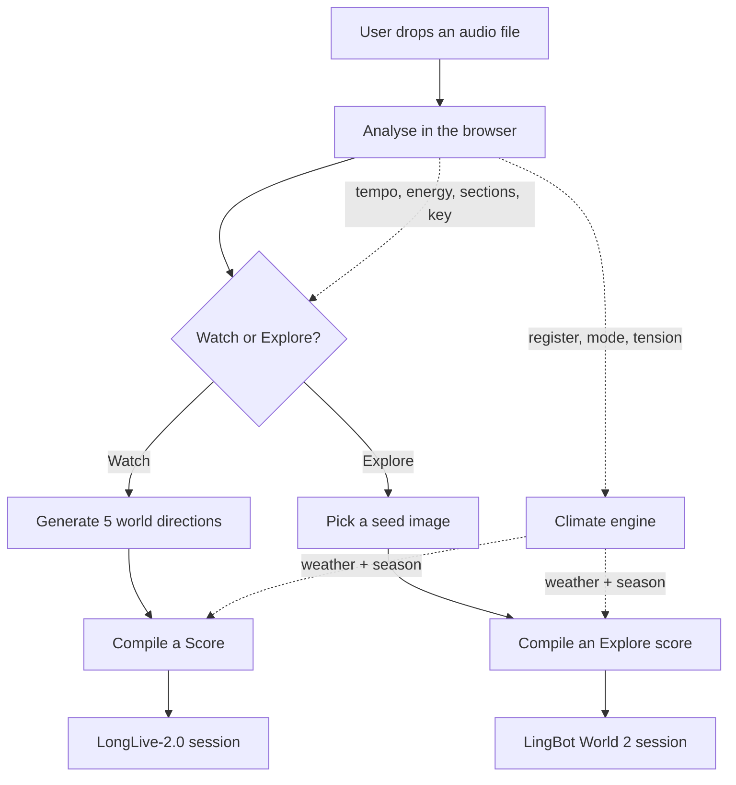
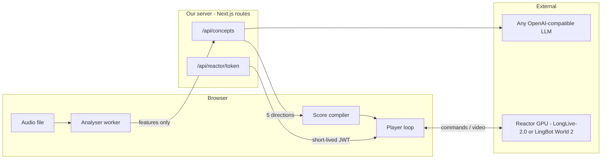
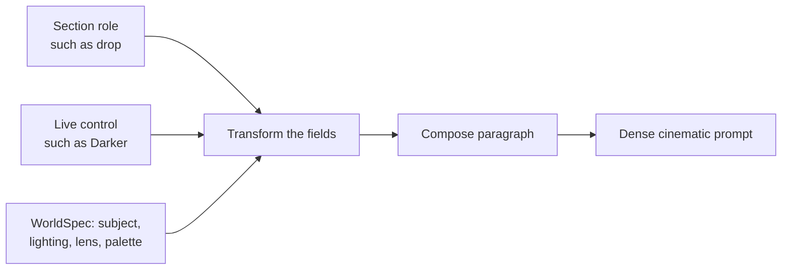
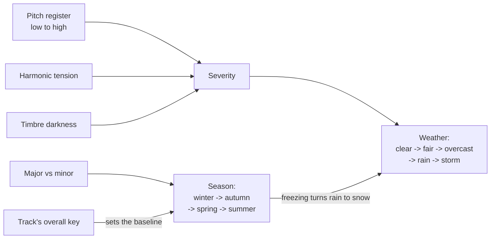

# How Worldscore works

Four screens, one idea: **a song is a control signal for a live world model.**

There are two ways to hear that idea. **Watch** is a film that cuts to the beat.
**Explore** puts you inside the world and lets you walk around while the music
moves the weather. Everything up to the final step is shared.

---

## 1. The whole thing, end to end



Each step in one line:

| Step | What happens | Where |
| --- | --- | --- |
| **Analyse** | Tempo, beat grid, energy, sections, key, register, harmonic tension | Browser |
| **Climate** | Turn register and mode into weather and season | Browser |
| **Generate** | Turn those features into 5 cinematic worlds (Watch only) | Server → LLM |
| **Compile** | Turn sections into timed cues, or into prompts plus camera inputs | Browser |
| **Run** | Fire those cues at the model while the song plays | Browser → Reactor GPU |

---

## 2. What runs where

This matters for privacy and cost.



Three things to notice:

- **The audio file never leaves the browser.** Only the derived numbers do. An
  unreleased mix stays on the musician's machine.
- **The API key never leaves the server.** The browser only ever gets a
  short-lived token scoped to one model.
- **Video comes straight from the GPU to the browser** over WebRTC. Our server
  isn't in the video path at all.

---

## 3. The clever bit: the steering loop

This is the part that makes it feel musical instead of random.

```mermaid
sequenceDiagram
    participant Song as Audio element
    participant Loop as Steering loop
    participant Model as LongLive-2.0

    Loop->>Model: set_shot "opening scene"
    Loop->>Model: start
    Model-->>Loop: generating
    Loop->>Song: play

    loop every animation frame
        Loop->>Song: what time is it?
        Song-->>Loop: 56.0s
        Note over Loop: a cut is due at 56.0s
        Loop->>Model: scene_cut "the drop scene"
    end

    Model-->>Loop: chunk_complete, scene chunk 41 of 48
    Note over Loop: near the scene limit
    Loop->>Model: scene_cut to stay alive
```

**The song is the master clock.** The model is not guaranteed to generate at
real time, so we never use its chunk counter for timing — we read
`audio.currentTime` and fire from that. Cues go out one chunk (~1.2s) early so
the change lands on the beat we aimed at.

The model's chunk counter is used for exactly one thing: a scene stops
generating at 48 chunks, so if we're close to that with nothing due, we cut
anyway.

---

## 4. From a section to a prompt

The model never receives "make it darker". It receives a full paragraph, rebuilt
every time.



A `WorldSpec` is a scene split into fields — subject, action, setting, time of
day, lighting, lens, camera move, palette, texture, render cue.

- A **section role** changes the camera and palette fields. A `drop` gets a
  violent crane move and maximum saturation; a `breakdown` gets a near-static
  hold and desaturation.
- A **live control** changes fields too. "Darker" rewrites lighting, palette and
  time of day.
- Then the composer renders **all** the fields into one paragraph.

Why rebuild the whole thing every time? Because a soft shot has to re-establish
the subject and setting or the model loses continuity. And because a field
transform is instant, while asking an LLM to rewrite the prompt would add
seconds to a live control.

---

## 5. Shots vs cuts

The one rule that drives the whole score:

| | Soft shot | Hard cut |
| --- | --- | --- |
| Feels like | same world, new beat | a new place |
| Scene memory | kept | wiped |
| Used for | verse, build, outro | drop, chorus, breakdown, bridge |
| Scene budget | spends it | **resets it** |

A scene dies at 48 chunks (~58 seconds). Only a cut resets that budget, so cuts
are also how a session runs longer than a minute. The compiler enforces this,
and the player double-checks it live.

---

## 6. The climate engine

The weather and the season are the channels the music steers most directly. One
rule makes them feel composed rather than random:

**Register and consonance are separate axes and must stay separate.** Low is not
the same as sad. A cello swell is low and warm; a diminished stab is high and
horrible. So pitch height drives how heavy the **weather** is, and
major-versus-minor drives which **season** we're in.



Fed into one dial, the world would change for contradictory reasons and stop
reading as intentional. Kept apart, a low major passage gives you a warm season
under a heavy sky — which is a real weather, and a specific one.

Two details carry most of the quality:

- **Seasons are relative, not absolute.** Real tracks cluster near the middle of
  the majorness range, so fixed thresholds would put every song in the same
  season. Instead the track's own key sets a baseline and each section's
  deviation from the track average moves it. A minor track lives in autumn and
  winter and visits spring; a major track does the reverse.
- **Everything is dwell-filtered.** A bassline crosses a register threshold
  several times a bar. Weather holds for 12 seconds minimum, seasons for 30, and
  in Watch mode a season may only change **on a hard cut** — a soft shot keeps
  the model's memory of the scene it's in, so asking for snow over a remembered
  summer field gets you a muddy half-change.

---

## 7. Explore mode

Same analysis, same climate, different model. LingBot World 2 is image-anchored
and navigable, which changes three things:

| | Watch (LongLive-2.0) | Explore (LingBot World 2) |
| --- | --- | --- |
| World comes from | a generated `WorldSpec` | a **seed image** (required) |
| Structure | shots and cuts, 48-chunk budget | prompts hot-swap freely |
| Camera | described in the prompt | **real control inputs** |
| You can | watch | walk around with WASD |

The camera difference matters most. Writing "violent sweeping crane move" into a
LingBot prompt would fight the actual pose inputs, so Explore strips camera
language from the text and emits it as control values instead.

Three constraints from the model shape the implementation:

- **A fresh world drops input while it materialises**, so the track is held back
  for a settling window rather than racing an unfinished scene.
- **Held moves accumulate drift**, because the model conditions on its own recent
  frames. Every score move runs for a bounded window and then settles.
- **Strafing is the least reliable axis.** Sideways intent is routed through
  turning, which the model handles well.

When the user grabs the keyboard the score yields the camera and takes it back a
couple of seconds after they stop.

---

## 8. Where the code lives

```
app/
  lib/audio/       decode -> STFT -> tempo, energy, sections, key, register
  lib/world/       WorldSpec, prompt composer, score compiler
    climate.ts       music -> weather and season
    score.ts         Watch: shots and cuts on a timeline
    explore.ts       Explore: prompts plus camera inputs
    seeds.ts         generated catalog of seed images
  lib/concepts/    LLM generation + offline fallback library
  lib/store.ts     which screen we're on, which mode, what's fired

  components/      Upload -> Analyzing -> ConceptBoard -> Player
                                       -> SeedBoard    -> ExplorePlayer
  api/             token minting, concept generation

  studio/page.tsx  the product
  landing/         the marketing page

scripts/
  check-analysis.ts       run the analyser and both compilers without a browser
  build-seed-catalog.mjs  crop seed images to 16:9, generate seeds.ts
```

---

## 9. Why it's built to swap models

Everything above the last step is model-agnostic. The analysis, the climate
engine and the score are just data; only the final hop translates a cue into
`set_shot` / `scene_cut` or into `set_prompt` plus drive axes.

Explore mode is the proof: it reuses the entire pipeline and replaces one file.
The same engine would drive Helios for tracks that should morph rather than cut.
Same on the input side — audio is one signal source, and webcam affect or a
dream description would produce cues the exact same way.
